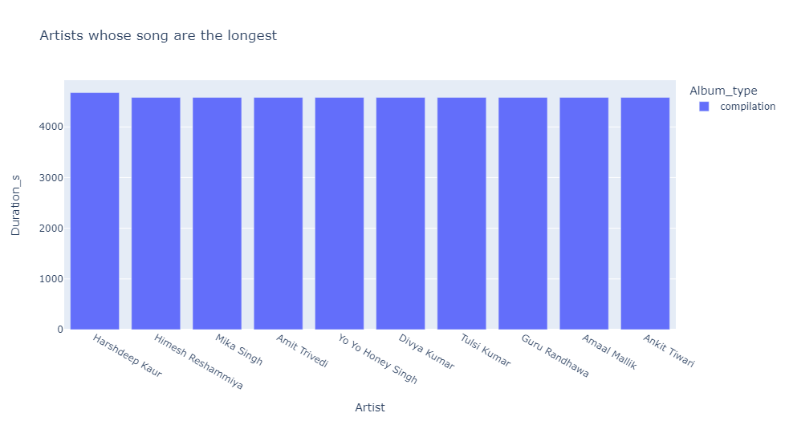
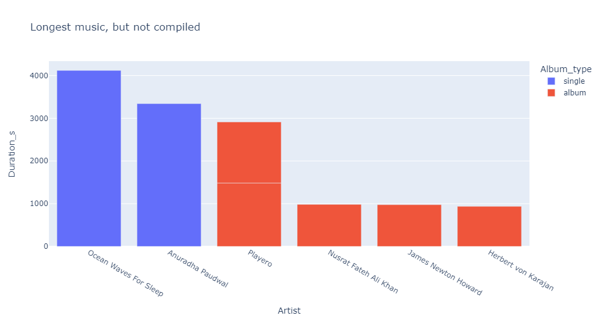
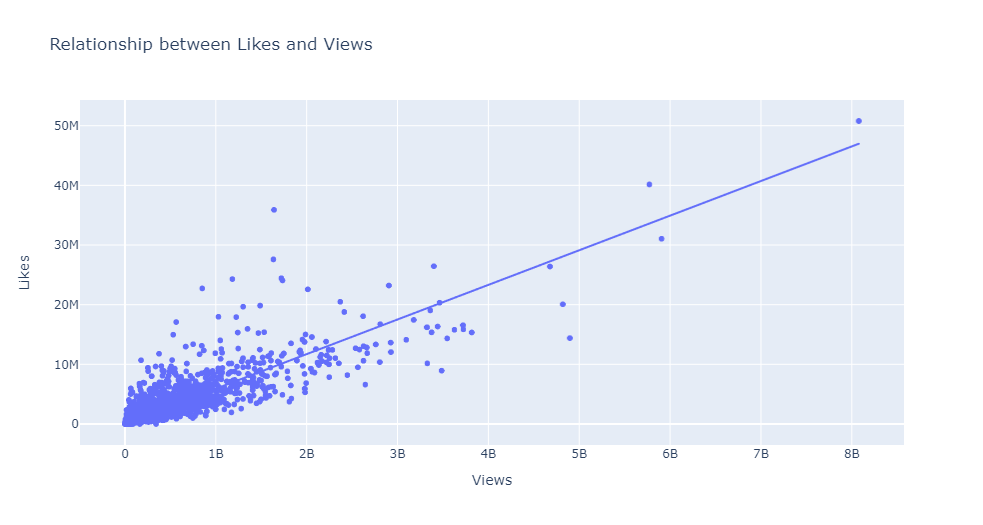
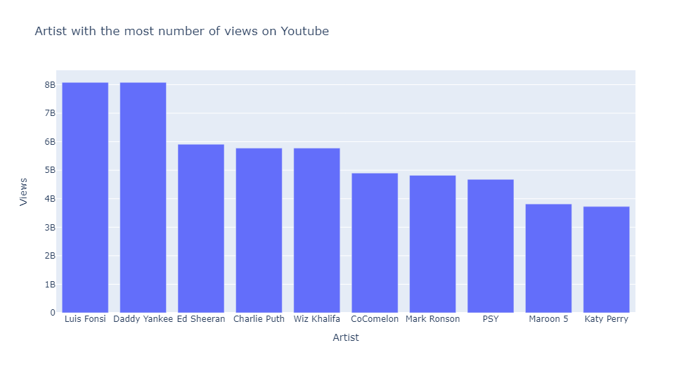
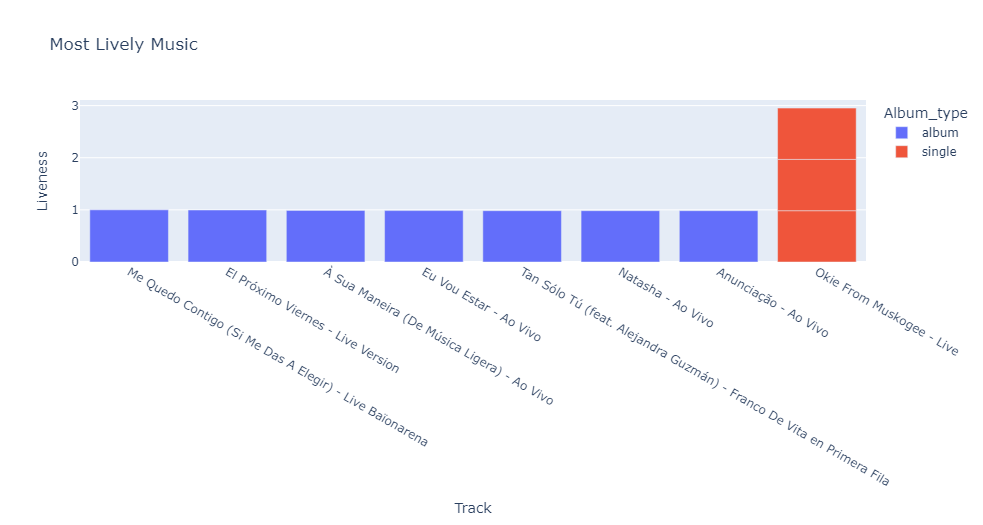

# Spotify-Youtube-Music-Analysis

## Introduction   
This is a project that makes use of Python Programming Language to analyze Spotify and Youtube Music. The project is to analyze and answer crucial questions and study how people listen to music, the kinds of Artists they listen to. ALso, look at the psychology behind the results of the kind of music people listen to. music is very important to life, so it's worth analyzing.

## Problem Statement
1.	Who are the Artists that produce the longest Music and what's the Album Type?
2.	Does the number of Views of a music have a correlation with the number of Likes the music gets?
3.  Who are the Artists with the highest number of views on youtube?
4.	Which Artists does the most lively Music?
5.	Does the danceability of a music has a relationship with the liveness of the music?
6.	What's the relationship between the number of streams of a music on Spotify and number of Views on Youtube?
7.	Artists with the highest numb er of Likes?
8.	The relationship between Energy and Loudness of Music?

## Skills and Concept Demonstrated
1.	Python
2.	Pandas
3.	Plotly.Express
4.	Matplotlib
5.	Seaborn

## Data Cleaning
I had to do some cleaning as there were lots of empty rows and columns. I dropped and filled some depending on the usefulness of the rows and columns.

## Visualization
Each Problem Statement have been answered through using different Visualization methods that can be interpreted and understood even by the layman. The data comes alive through these Visuals

1.	Who are the Artists that produce the longest Music and what's the Album Type?

Since the Album Type is 'compilation', Let's check for the longest music that's not compiled

2. Does the number of Views of a music have a correlation with the number of Likes the music gets?

This Kind of chart shows that there is a positive correlation between the two variables been investigated. It means that as the number of views increase, the number of the likes also gets increased. The variables are directly proportional to each other.

3.  Who are the Artists with the highest number of views on youtube?

4. Which Artists does the most lively Music?

5. Does the danceability of a music has a relationship with the liveness of the music?

