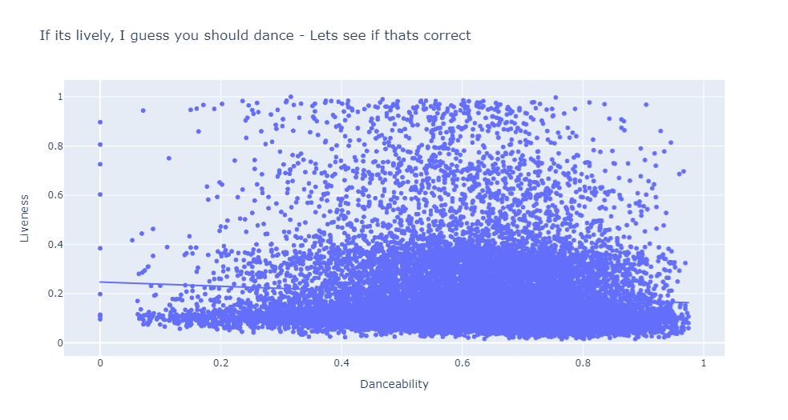
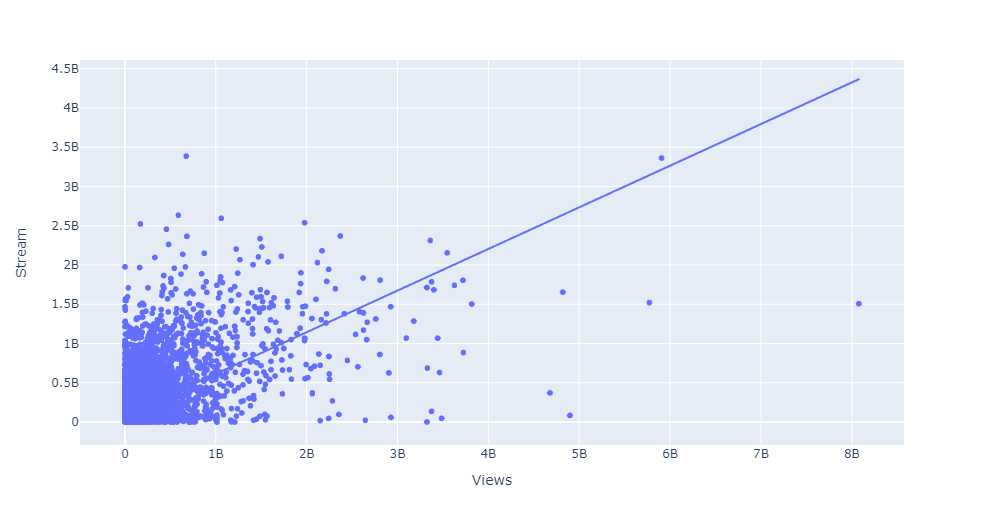
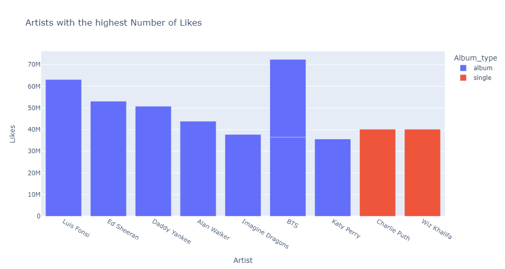
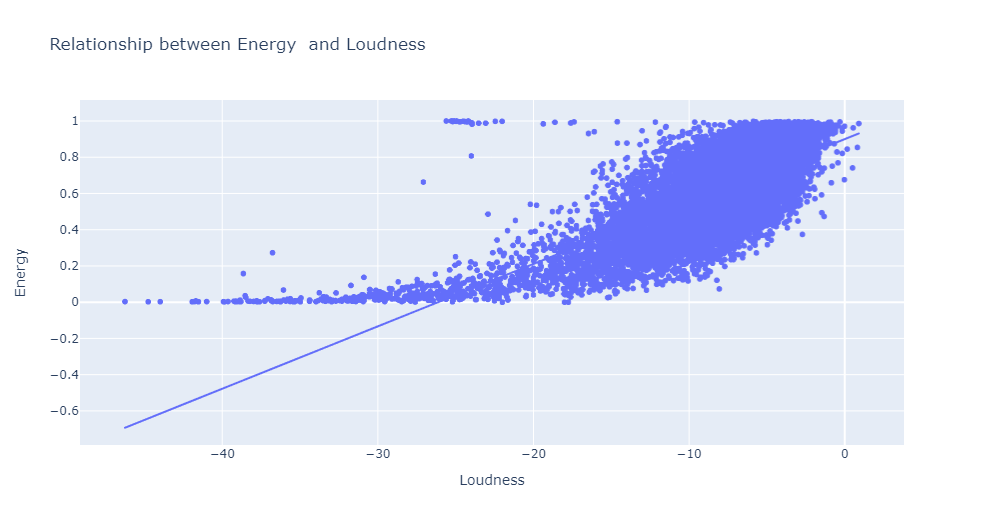
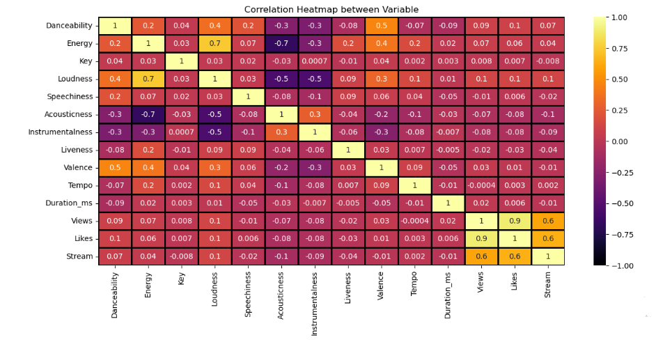

# Spotify-Youtube-Music-Analysis

## Introduction   
This is a project that makes use of Python Programming Language to analyze Spotify and Youtube Music. The project is to analyze and answer crucial questions and study how people listen to music, the kinds of Artists they listen to. ALso, look at the psychology behind the results of the kind of music people listen to. music is very important to life, so it's worth analyzing.

## About the Data
Has about 20,000 rows and 28 columns

## Problem Statement
1.	Who are the Artists that produce the longest Music and what's the Album Type?
2.	Does the number of Views of a music have a correlation with the number of Likes the music gets?
3.  Who are the Artists with the highest number of views on youtube?
4.	Which Artists does the most lively Music?
5.	Does the danceability of a music has a relationship with the liveness of the music?
6.	What's the relationship between the number of streams of a music on Spotify and number of Views on Youtube?
7.	Artists with the highest number of Likes on Youtube?
8.	The relationship between Energy and Loudness of Music?

## Skills and Concept Demonstrated
1.	Python
2.	Pandas
3.	Plotly.Express
4.	Matplotlib
5.	Seaborn

## Data Cleaning
I had to do some cleaning as there were lots of empty rows and columns. I dropped and filled some depending on the usefulness of the rows and columns.

## Visualization
Each Problem Statement have been answered through using different Visualization methods that can be interpreted and understood even by the layman. The data comes alive through these Visuals

1.	Who are the Artists that produce the longest Music and what's the Album Type?

Since the Album Type is 'compilation', Let's check for the longest music that's not compiled

2. Does the number of Views of a music have a correlation with the number of Likes the music gets?

This Kind of chart shows that there is a positive correlation between the two variables been investigated. It means that as the number of views increase, the number of the likes also gets increased. The variables are directly proportional to each other.

3.  Who are the Artists with the highest number of views on youtube?

4. Which Artists does the most lively Music?

5. Does the danceability of a music has a relationship with the liveness of the music?

SO, honestly, I was a bit surprised by this result because its negatively correlated which means that, beung danceable doesn't mean its lively. Where I come from, if it's Live band, you're in for some cool dance. But, data doesn't lie, so there it is. 

6. What's the relationship between the number of streams of a music on Spotify and number of Views on Youtube?

It is directly proportional and it means that the more people stream your music on spotify. they are likely to watch it on Youtube. Good Music will always have listeners.

7. Artists with the highest number of Likes on Youtube?

8. The relationship between Energy and Loudness of Music?

I'm correct on this, I thought they should be positively correlated as you need some for form of Energy to do Loud Music.

9. Finally, the correlation Chart
10. 

## Conclusion
Music is the Language of the soul and deriving insights from this data makes so much sense and strectched my Python Skills.
To check the codes, check through files for 'Spotify Project'.

### PS: For more information, you can check through my code file itself. It's the IPYNB File.
However, to get to view the codes with the charts and visuals, you have to take the following steps:

Open this link 'http://nbviewer.jupyter.org/
paste this link within the link above 'https://github.com/EnochBabs/Spotify-Youtube-Music-Analysis/blob/main/Spotify%20Project.ipynb'

Thank you!
